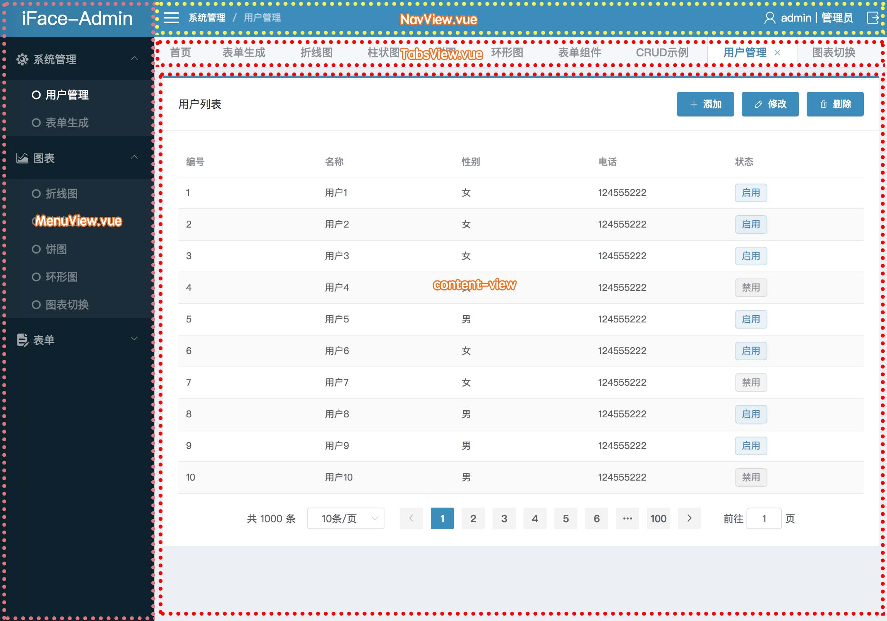

## Layout

除登录页和404页面外，其他页面的采用统一的布局文件。包含一个产品最外层的框架结构，导航、侧边栏、面包屑以及内容等。


## 路由嵌套

项目路由结构大致如下：

```js
const router = new Router({
  routes: [
    ...publicRouter,
    {
      path: '/',
      component: MainLayout,
      children: [
        ...common,
        ...system,
        ...demo,
      ],
    },
    {
      path: '*',
      component: Page404,
    },
  ],
})
```

* 除publicRouter里面的页面（登录等）和404页面外，其他页面统一使用MianLayout作为布局文件
* 每个模块的路由在模块文件夹下的router.ts单独维护，统一导出到全局的路由配置

## router-view

为简化路由配置，项目的路由总共嵌套2层，分别对应如下的router-view组件

1. [App.vue](https://github.com/ccqiuqiu/iface/blob/f3bf733342f9151e62af6dbfe0c92145979e8caa/src/App.vue)
2. [MainLayout.vue](https://github.com/ccqiuqiu/iface/blob/f3bf733342f9151e62af6dbfe0c92145979e8caa/src/modules/common/view/MainLayout.vue)

::: warning 注意
一般情况下，不要再增加路由的层级
:::


## 总体布局如下

* 左侧菜单：[MenuView.vue](https://github.com/ccqiuqiu/iface/blob/f3bf733342f9151e62af6dbfe0c92145979e8caa/src/modules/common/view/MenuView.vue)
* 顶部面包屑：[NavView.vue](https://github.com/ccqiuqiu/iface/blob/f3bf733342f9151e62af6dbfe0c92145979e8caa/src/modules/common/view/NavView.vue)
* 顶部标签页：[TabsView.vue](https://github.com/ccqiuqiu/iface/blob/f3bf733342f9151e62af6dbfe0c92145979e8caa/src/modules/common/view/TabsView.vue)
* 内容部分：content-view 对应路由组件




## 关于滚动

* 左侧菜单超过屏幕高度时会开启滚动
* content-view高度占满内容区域，当里面的内容超过高度的时候，会开启滚动
* 顶部固定不滚动